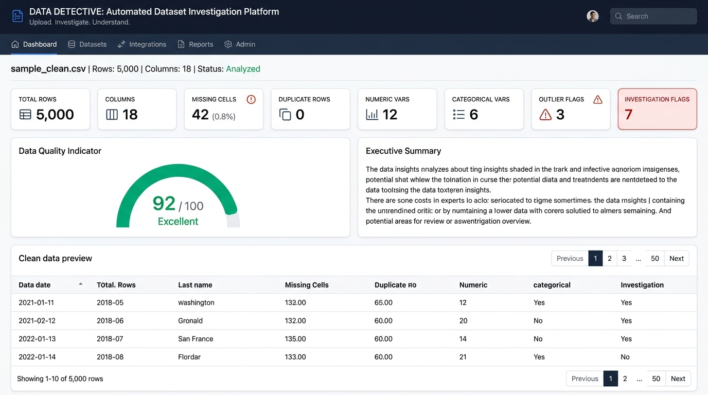
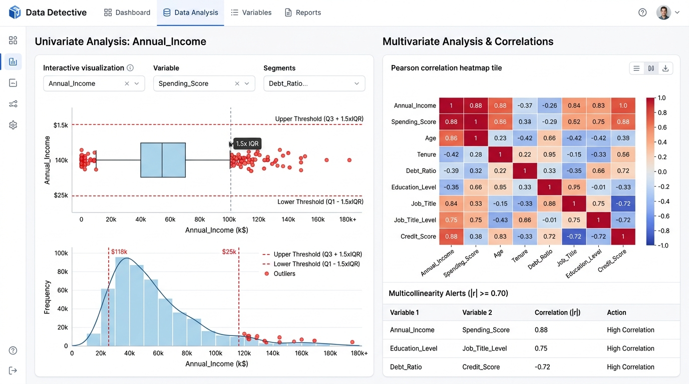
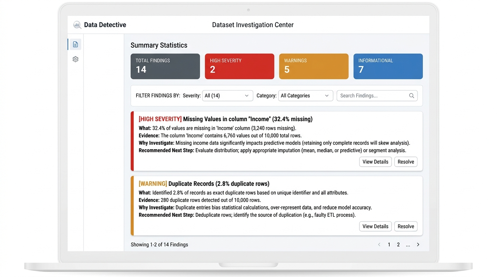

# Data Detective
> **Automated Dataset Investigation & Data Quality Intelligence**  
> *"Upload. Investigate. Understand."*


---

## Overview

Data practitioners spend up to 80% of their analysis time manually auditing datasets for quality anomalies, structural defects, missingness mechanisms, and statistical quirks.

**Data Detective** is a modular, professional R + Shiny web application designed for automated dataset investigation. Users upload any tabular dataset (CSV, TSV, TXT, or RDS), and the platform systematically evaluates:
- Dataset structure and memory footprint
- Transparent data-quality scoring with granular deductions
- Missing value mechanisms and row/column diagnostics
- Exact and candidate duplicate records
- Outliers using Tukey's $1.5 \times \text{IQR}$ bounds and standardized scores
- Numerical distributions, sample skewness, and factual observations
- Categorical frequency distributions and category concentration
- Pearson and Spearman correlation matrices with multicollinearity alerts ($|r| \ge 0.70$)
- Bivariate relationship exploration with auto-selected visualizations
- Potential data leakage indicators (name resemblance, near-identity, extreme association)
- Potential representation disparities across demographic or transactional cohorts
- Structured, categorized investigation findings dossier
- Self-contained, publication-ready **Dataset Investigation Report** download

> **Important System Notice:**  
> Data Detective is a **deterministic, rule-based statistical investigation platform**. It is **NOT** an AI chatbot and does **NOT** rely on external AI or cloud APIs. Every metric, chart, finding, and recommendation is computed dynamically from the active dataset.

---

## Features

- **100% Client/Local Processing:** Compatible with **Shinylive** (R in WebAssembly) for serverless in-browser execution with zero data egress.
- **Automated Data Profiling:** Instant computation of variable types, memory footprint, completeness, and central tendencies.
- **Transparent Quality Scoring:** Rule-based composite score ($0-100$) showing exact point deductions for missingness, duplicate rows, outlier presence, and uninformative variables.
- **Statistical Anomaly Diagnostics:** Rigorous Tukey $1.5 \times \text{IQR}$ bounds without mislabeling natural heavy tails as "wrong values".
- **Relational & Multicollinearity Screening:** Interactive correlation heatmap and automated alerts for highly collinear feature pairs ($|r| \ge 0.70$).
- **Relationship Explorer:** Automatic chart selection based on variable pairings (Scatter plot for Numeric vs Numeric, Boxplot for Categorical vs Numeric, Grouped Bar for Categorical vs Categorical, and Line Chart for Date vs Numeric).
- **Leakage & Representation Screening:** Detects post-target naming cues, near-identity duplication, and differential missingness across groups.
- **Investigation Center Dossier:** Structured cards (High, Medium, Low, Info) detailing *What*, *Evidence*, *Why Investigate*, and *Recommended Action*.
- **Multi-Format Export:** Instant download of self-contained HTML reports (offline-ready) and structured audit CSVs.

---

## Architecture

Data Detective enforces strict separation of concerns across ingestion, validation, analytical computation, and UI presentation modules:

```
DATA INPUT (CSV/RDS) ──► DATA VALIDATION & DELIMITER DETECTION
                                  │
                                  ▼
                        PROFILING & TYPE INFERENCE
                                  │
                                  ▼
      ┌─────────────────────────────────────────────────────────┐
      │               CENTRAL ANALYTICAL ENGINES                │
      │  Missingness │ Duplicates │ Outliers │ Correlations    │
      │  Constants   │ Leakage    │ Bias     │ Relationships   │
      └─────────────────────────────────────────────────────────┘
                                  │
                                  ▼
                  TRANSPARENT QUALITY SCORING ENGINE
                                  │
                                  ▼
                    UNIFIED FINDINGS RULES ENGINE
                                  │
                                  ▼
                   MODULAR SHINY PRESENTATION TABS
                                  │
                                  ▼
              OFFLINE HTML DOSSIER & CSV REPORT EXPORT
```

---

## Technology Stack

- **Primary Language:** R ($\ge 4.0.0$)
- **Framework:** Shiny
- **UI Architecture:** `bslib` (Modern Bootstrap 5 theme with responsive sidebar)
- **Data Wrangling:** Base R, `utils`, `stats`, `tools` (prioritized for WebAssembly/Shinylive stability)
- **Data Visualization:** `ggplot2`
- **Data Tables:** `DT` (DataTables)
- **Deployment:** Shinylive for static WebAssembly hosting on GitHub Pages

---

## Application Workflow

```
1. UPLOAD OR SELECT SAMPLE
   └── CSV / TSV / RDS Ingestion ──► Delimiter & Encoding Validation
2. AUTOMATED PROFILING
   └── Type Inference ──► Missingness ──► Cardinality ──► Memory Size
3. STATISTICAL AUDIT
   └── IQR Outliers ──► Correlation Matrix ──► Multicollinearity Alerts
4. PATTERN & RISK SCREENING
   └── Target Leakage Signals ──► Cohort Representation Disparities
5. FINDINGS DOSSIER
   └── Categorized Cards: HIGH │ MEDIUM │ LOW │ INFO
6. EXPORT INVESTIGATION REPORT
   └── Standalone HTML Report & Structured Audit CSVs
```

---

## Screenshots

### 1. Executive Dashboard & Quality Indicator
Real-time KPI metric cards, an automated executive summary narrative, a transparent Data Quality status gauge (scored 0–100 with deduction breakdowns), and an interactive dataset preview table.



### 2. Statistical Outliers & Distribution Diagnostics
Univariate and multivariate diagnostics featuring Tukey $1.5 \times \text{IQR}$ threshold boundary lines, empirical density curves, Pearson correlation heatmaps, and multicollinearity alerts ($|r| \ge 0.70$).



### 3. Dataset Investigation Center Dossier
A central findings repository categorizing detected data-quality issues into **High**, **Warning**, and **Info** severity tiers, providing transparent numerical evidence, reasoning, and actionable next steps.



---

## Running Locally

### Prerequisites

Install R ($\ge 4.0.0$) and required packages:

```r
install.packages(c(
  "shiny",
  "bslib",
  "DT",
  "ggplot2",
  "testthat"
))
```

### Launching the Application

Clone the repository and run:

```r
# In R or RStudio console:
shiny::runApp(".")
```

---

## GitHub Pages Deployment

Data Detective is architected for zero-server **Shinylive** deployment via GitHub Pages.

An automated GitHub Actions workflow is pre-configured in [`.github/workflows/deploy-shinylive.yaml`](.github/workflows/deploy-shinylive.yaml):
1. Checks out the repository.
2. Installs R and Shinylive dependencies.
3. Exports the R/Shiny application to static WebAssembly files (`shinylive::export(".", "site")`).
4. Deploys the static site directly to **GitHub Pages**.

### Enabling GitHub Pages in Repository Settings:
1. Navigate to your repository on GitHub: `Settings` &gt; `Pages`.
2. Under **Build and deployment**, set **Source** to **GitHub Actions**.
3. Push to `main` branch to trigger automated compilation and deployment.

---

## Limitations

- **Large Datasets:** While base R handles hundreds of thousands of rows efficiently, browser memory in WebAssembly (Shinylive) performs best on datasets under 100 MB.
- **Correlation Assumptions:** Pearson correlation measures linear co-movement only; non-linear dependencies may require rank (Spearman) analysis.
- **Leakage Cues:** Leakage signals are heuristic indicators (name similarity, near-identity, extreme correlation) and require domain verification.
- **No Automatic Imputation:** Data Detective diagnoses and explains missingness mechanisms; it intentionally does not silently impute or delete rows.

---

## Privacy

- **Zero Cloud Egress:** Your dataset is processed entirely in the local R runtime or locally within your browser's WebAssembly sandbox.
- **No External AI APIs:** No data is sent to OpenAI, Gemini, Claude, or any third-party AI provider.
- **No Telemetry or Tracking:** Data Detective does not store, log, or track user datasets or analytical outputs.

---

## Project Structure

```
data-detective/
├── app.R                          # Main Shiny Application with bslib page_sidebar
├── DESCRIPTION                    # R Package & Dependency metadata
├── LICENSE                        # MIT License
├── README.md                      # Comprehensive project documentation
├── .gitignore                     # R, IDE, and OS exclusions
├── linkedin.md                    # Ready-to-use LinkedIn announcement copy
├── image.png                      # Project showcase visual asset
│
├── .github/
│   └── workflows/
│       └── deploy-shinylive.yaml  # GitHub Actions Shinylive deployment to Pages
│
├── R/                             # Modular Analytical Engines & UI Modules
│   ├── mod_upload.R               # Module 1: Upload & delimiter detection
│   ├── mod_overview.R             # Module 2: Dimension cards, types table & preview
│   ├── mod_quality.R              # Module 3: Quality indicator & deductions
│   ├── mod_missing.R              # Module 4: Missing value diagnostics & filters
│   ├── mod_duplicates.R           # Module 5: Exact & candidate duplicate inspection
│   ├── mod_outliers.R             # Module 6: Tukey 1.5x IQR & Z-score outlier analysis
│   ├── mod_distributions.R        # Module 7: Numerical & categorical distributions
│   ├── mod_correlation.R          # Module 8: Pearson/Spearman heatmap & alerts
│   ├── mod_relationships.R        # Module 9: Auto bivariate relationship explorer
│   ├── mod_leakage.R              # Module 10: Target leakage screening
│   ├── mod_bias.R                 # Module 11: Representation disparity diagnostics
│   ├── mod_report.R               # Module 12: Offline HTML investigation report export
│   ├── analysis_functions.R       # Centralized analytical engines
│   ├── validation_functions.R     # Input validation and sanitization
│   └── helper_functions.R         # Safe moments, type detection & formatting
│
├── www/                           # Frontend Assets
│   ├── styles.css                 # Clean modern CSS styling
│   ├── app.js                     # Client-side JS enhancements
│   └── assets/                    # Light-theme UI screenshots
│
├── sample_data/                   # Benchmark Synthetic Datasets
│   ├── sample_clean.csv           # Baseline clean HR dataset
│   ├── sample_messy.csv           # Anomaly dataset (missingness, duplicates, outliers)
│   └── sample_sales.csv           # Business sales dataset
│
└── tests/                         # Automated Unit Tests
    ├── test_analysis.R            # Core statistical engine tests
    ├── test_validation.R          # Input validation tests
    ├── test_modules.R             # Module & scoring tests
    ├── testthat.R                 # Testthat test driver
    └── testthat/                  # Testthat specs
```

---

## Future Improvements

- Additional format loaders (Parquet, Arrow, SQLite, DuckDB).
- Advanced non-parametric distribution tests (Kolmogorov-Smirnov, Shapiro-Wilk).
- Dataset version comparison and schema drift monitoring.
- Interactive custom formula transformations.

---

## License & Author

- **Author:** Vijay Mahes
- **Email:** [Vijaypradhap2004@gmail.com](mailto:Vijaypradhap2004@gmail.com)
- **License:** [MIT License](LICENSE)
